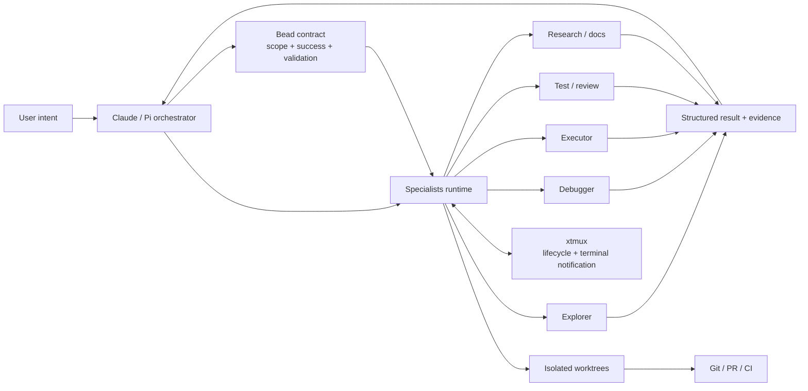
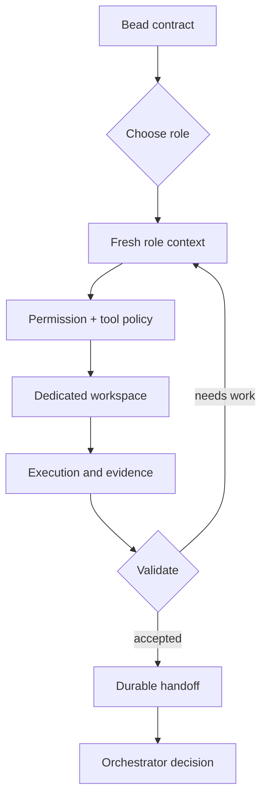
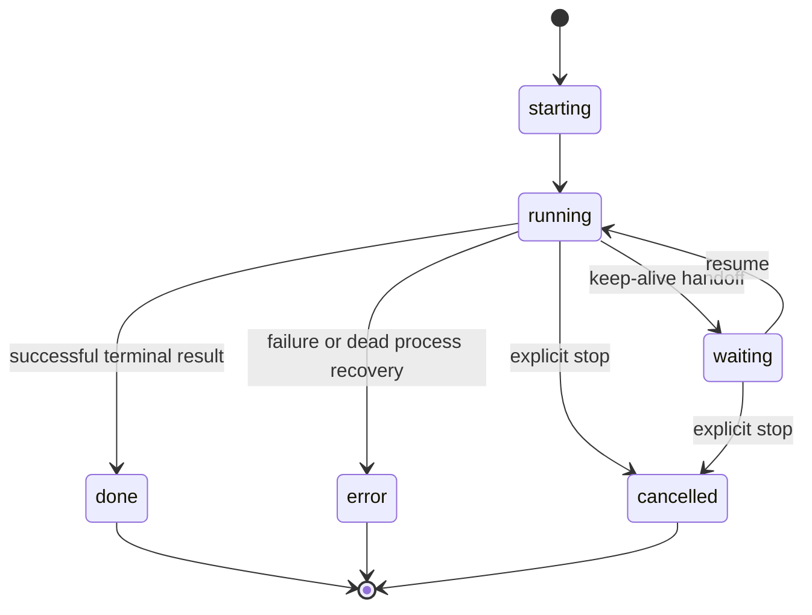

# Specialists

[](https://www.npmjs.com/package/@jaggerxtrm/specialists)
[](LICENSE)
[](https://www.typescriptlang.org/)

> [!WARNING]
> **Documentation freshness**
>
> Specialists is under active development toward the next major stable line. Long-form documentation can lag behind the runtime.
> For the exact revision or installed version you are using, treat these as the operational authorities:
>
> 1. the source and generated contracts at that revision;
> 2. `sp --help` and `sp <command> --help`;
> 3. the canonical `/using-specialists` and `/using-xtrm` skills shipped with the same stack version;
> 4. `CHANGELOG.md`, release notes, and merged pull requests.
>
> The README is an orientation surface, not a substitute for the live command contract. For development or integration work, clone and inspect Specialists, Core, and xtmux together rather than relying only on npm package contents.

**Specialists is a role-bounded cognitive and execution runtime for getting real software work done.**

It is not merely “run many agents.” It gives an orchestrator fresh, scoped faculties—explorer, debugger, executor, test-engineer, reviewer, security auditor, researcher, documentation specialist—without forcing every hypothesis, tool trace, and decision into one contaminated context window.

Each job receives a bounded task contract, tools, rules, model surface, workspace, and output contract. Results return as durable evidence, not conversational memory.

## Position in the XTRM stack



| Component | Responsibility |
|---|---|
| **Specialists** | Execute and persist bounded jobs, results, handoffs, telemetry, and review evidence |
| **XTRM Tools** | Launch and govern orchestrators, distribute skills/policies, aggregate topology, maintain the stack |
| **xtmux** | Carry runtime identity, messages, waits, monitors, completed turns, and terminal pointers |
| **Beads** | Hold the durable task contract and cross-session memory |
| **Git / GitHub** | Remain the publication and integration authority |

Installing [xtrm-tools](https://github.com/xtrm-dev/core) is a strong operational requirement. Specialists expects the rest of the XTRM stack to provide the normal launcher, hooks, skills, Beads workflow, and coordination substrate.

## Why bounded specialist contexts

A single long agent session accumulates:

- abandoned hypotheses;
- stale plans;
- tool-output residue;
- self-review bias;
- forgotten constraints;
- mixed role instructions;
- context-window pressure.

Specialists replaces context hoarding with **contract-bound cognition**:



The orchestrator remains the central executive. Specialists are temporary faculties, not independent product owners.

## What Specialists can do now

| Need | Surface |
|---|---|
| Map unfamiliar code | `sp run explorer` |
| Diagnose an unknown failure | `sp run debugger` |
| Implement scoped changes | `sp run executor` |
| Generate tests from actual changes | `test-engineer` |
| Run and classify validation | `test-runner` |
| Challenge scope and implementation quality | `seconder` |
| Review against the Bead contract | `reviewer` |
| Audit sensitive changes | `security-auditor` |
| Research current external evidence | researcher and domain roles |
| Repair or synchronize documentation | `sync-docs`, service-knowledge roles |
| Run immediate generation contracts | `sp script`, `sp serve` |
| Observe jobs across repositories | `sp console`, `sp ps`, `sp feed`, `sp log` |
| Retrieve exact terminal output | `sp result <job-id> --json` |
| Continue an intentional waiting job | `sp resume` |
| Steer a live job | `sp steer` |

The live catalog is authoritative:

```bash
sp list
sp list --compact
sp list-rules
sp help
```

## Runtime lifecycle



Specialists persists job status and events in SQLite. Successful and error terminal transitions publish one bounded pointer to the verified parent through xtmux, including the exact `sp result <job-id> --json` retrieval command. Notification failure never rolls back a completed job.

Dead processes are reconciled to `error` so an orchestrator is not left waiting forever.

## Install and bootstrap

Specialists is Bun-first and expects the XTRM stack to be installed explicitly:

```bash
# Bun
curl -fsSL https://bun.sh/install | bash

# XTRM stack
npm install --global \
  xtrm-tools \
  @jaggerxtrm/xtmux \
  @jaggerxtrm/specialists

# Machine and repository setup
xt install
xt init -y
sp init --global
sp init
sp doctor --specialists
sp list
```

Package specialist definitions intentionally ship without forcing one provider/model choice. Machine-level configuration supplies model assignments:

```bash
sp models
sp edit --global
sp doctor --specialists
```

Configuration layers:

1. package canonical specialist definitions;
2. `~/.config/specialists/user.json`;
3. repository-local `.specialists/user/` overrides.

## First tracked workflow

Create and claim a task contract:

```bash
bd create "Investigate flaky checkout flow" -t bug -p 1 --json
bd update <bead-id> --claim --json
```

Dispatch fresh roles:

```bash
sp run explorer --bead <bead-id> --background --json
sp result <explorer-job-id> --wait --timeout 900 --json

sp run debugger --bead <bead-id> --background --json
sp result <debugger-job-id> --wait --timeout 900 --json

sp run executor --bead <bead-id> --worktree --background --json
sp result <executor-job-id> --wait --timeout 1800 --json

sp run reviewer --bead <bead-id> --job <executor-job-id> --background --json
sp result <reviewer-job-id> --wait --timeout 900 --json
```

For a live keep-alive job:

```bash
sp steer <job-id> "focus on the API boundary"
sp resume <job-id> "continue with this additional evidence"
sp stop <job-id>
```

Ad-hoc prompt runs remain available, but tracked implementation work should use Beads.

## Workspaces and branch lineage

Edit-capable roles normally run in isolated worktrees. When dispatched from an XTRM coordinator, the job branch inherits the coordinator’s published branch rather than silently starting from the repository default branch.

This makes chained work see the coordinator’s current implementation while preserving isolation and explicit integration.

Read-only roles can inspect without acquiring write authority.

## Result and event surfaces

```bash
sp ps
sp result <job-id> --json
sp result <job-id> --wait --timeout 900 --json
sp feed <job-id> --json
sp feed <job-id> --follow
sp log <job-id>
sp forensic <job-id> --json
sp metrics --prometheus
```

`sp run --json` and `sp feed --json` emit Pi-compatible NDJSON for foreground/replay consumers. Detached launches use the distinct `specialists.background_launch.v1` event and return a job identifier for later retrieval.

The private observability database is an implementation detail. External consumers should use public CLI surfaces instead of querying the SQLite schema directly.

## Operator console

`sp console` aggregates configured repositories into one terminal dashboard:

- active and historical jobs;
- per-repository views;
- feed and result inspection;
- Bead and diff context;
- role/config views;
- direct stop, resume, and navigation actions.

```bash
sp console
sp console --add-repo ~/dev/project
sp ps
```

## Publication and integration

**Git and pull requests are currently the canonical publication path.**

`sp merge` and `sp epic merge` are known-broken legacy publication surfaces and must not be used until their separate rework lands, even if a help surface still exposes them.

After reviewer acceptance, follow the canonical `/using-specialists` merge-and-integration procedure. At minimum:

```bash
git checkout <target-branch>
git pull --ff-only origin <target-branch>
git merge --no-ff <specialist-branch>
git push origin <target-branch>
```

Then remove the merged worktree and branch after verifying the integration.

The important separation is:

- Specialists creates work and evidence.
- Review roles judge the work.
- The orchestrator/operator decides publication.
- Git remains the source of integration truth.

## Script and service modes

Use `sp script` or `sp serve` when you need an immediate generation contract rather than a managed interactive job:

```bash
sp script <name> --vars key=value --json

sp serve --port 8000 --readiness-canary warn
curl -sS http://localhost:8000/v1/generate \
  -H 'content-type: application/json' \
  -d '{"specialist":"hello","variables":{"name":"world"}}'
```

Trusted local-script and write-capable execution require explicit enablement.

## Observability

Runtime state is DB-first:

```text
.specialists/db/observability.db
```

File artifacts under `.specialists/jobs/` are secondary recovery and operator surfaces.

Specialists records:

- job lifecycle;
- model/backend and timing;
- token usage where available;
- structured forensic events;
- branch-integration evidence;
- terminal result and handoff state;
- Prometheus-compatible low-cardinality metrics.

## Authority and safety model

- The Bead defines problem, scope, success criteria, and validation.
- The role definition controls tools, permissions, model surface, and output contract.
- Results are evidence for the orchestrator; they do not independently expand scope.
- Review roles should not share the implementer’s contaminated context.
- A terminal notification is a pointer, not the full private result.
- Parent notification and Bead-note append are fail-open relative to job completion.
- Git and the operator remain the integration authority.

## Current boundaries

The runtime supports explicit role dispatch, chain-aware branch inheritance, managed jobs, review loops, structured results, and terminal parent notification.

The broader deterministic chain-template resolver described in the XTRM design documents is not yet implemented. Current chains are orchestrator-driven and contract-bound rather than generated by one canonical DAG engine.

## Documentation

| Document | Purpose |
|---|---|
| [specialists.scheme.md](specialists.scheme.md) | Cognitive model and rationale |
| [docs/installation.md](docs/installation.md) | Installation |
| [docs/bootstrap.md](docs/bootstrap.md) | Bootstrap and configuration |
| [docs/authoring.md](docs/authoring.md) | Specialist authoring |
| [docs/cli-reference.md](docs/cli-reference.md) | Detailed CLI reference |
| [docs/specialists-service.md](docs/specialists-service.md) | Script/service runtime |
| [docs/testing.md](docs/testing.md) | Test lanes and quarantine policy |
| [config/skills/using-specialists/SKILL.md](config/skills/using-specialists/SKILL.md) | Canonical workflow router |
| [CHANGELOG.md](CHANGELOG.md) | Released changes |

## Development

```bash
bun install
bun run lint
bun run build
bun --bun vitest run
```

The default test lane runs under Bun. Running Vitest through Node is intentionally rejected because the runtime depends on `bun:sqlite`.

---

MIT License
