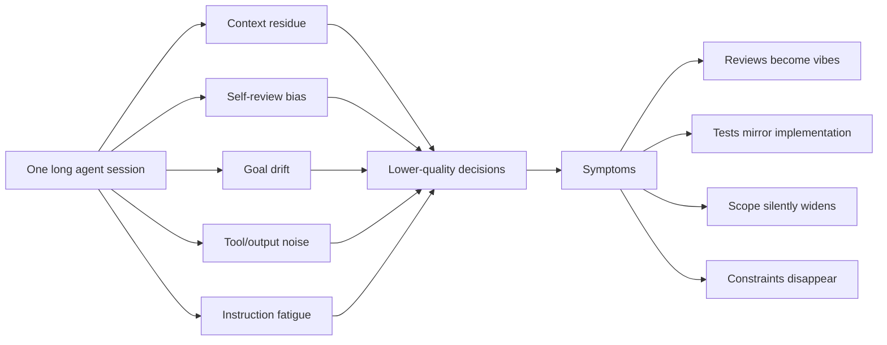
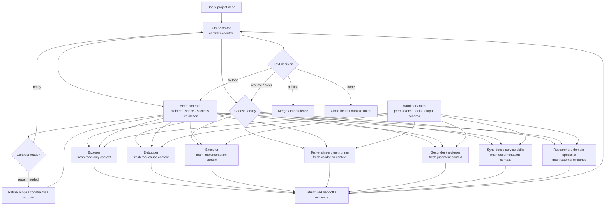

# Specialists

[](https://www.npmjs.com/package/@jaggerxtrm/specialists)
[](LICENSE)
[](https://www.typescriptlang.org/)

# **WARNING**
`docs/` might be stale at the current moment. The project is in active and quick development toward v4.0 and stable version, please refer to:
  - sp --help;
  - using-specialists skill;
  - using-xtrm skill;
  - all other skills INCLUDING those in the `xtrm-dev/core` repo;
  - cloning the repo and understanding it with your agents is strongly recommended vs only installing the npm package;
  - CHANGELOG.md, release notes, and prs themselves

Installing https://www.github.com/xtrm-dev/core (xtrm-tools on npm) is a strong requirement

**Specialists is an agent-mind runtime for getting real work done.**

It is not just “run many agents”. The core idea is that a long single-agent chat becomes cognitively contaminated: old hypotheses, abandoned plans, tool residue, self-review bias, forgotten constraints, and context-window noise all accumulate in one mind. Quality drops because the same context tries to be explorer, implementer, tester, reviewer, security auditor, memory keeper, and release operator at once.

Specialists gives an AI workflow a healthier shape:

- the **orchestrator** stays the central executive — it owns the user intent, task identity, evidence, and publication decision;
- the **bead** is the contract and durable working memory — problem, scope, success criteria, validation, dependencies, and handoffs live there;
- **specialists** are fresh, scoped cognitive faculties — explorer, debugger, executor, test-engineer, reviewer, sync-docs, researcher, and domain roles each get only the context, tools, rules, and output contract they need;
- **structured handoffs** flow back to the orchestrator — results are evidence to consume, not conversational vibes to remember;
- **workspaces and gates** keep changes publishable — edit-capable roles work in branches/worktrees, reviewer/QA/security roles judge against the contract.

The result is a shared project mind: continuity without hoarding every detail in one agent’s context.

Specialists sits in the xt/xtrm stack:

- **[pi coding agent](https://github.com/earendil-works/pi-coding-agent)** executes model sessions and exposes tool events/RPC boundaries.
- **[xtrm-tools](https://github.com/Jaggerxtrm/xtrm-tools)** provides operator workflow: worktree sessions, `.xtrm/` skills/hooks, reports, update tooling, and gates.
- **[beads](https://github.com/steveyegge/beads)** provides issue IDs, claims, dependencies, task contracts, and durable notes.

See [specialists.scheme.md](specialists.scheme.md) for the full rationale.

---

## Why not one big agent chat?



The problem is not only token count. It is **cognitive contamination**. A single context window carries every role’s history, including false starts and stale assumptions. The agent starts defending its own implementation, testing what it built instead of what was requested, and treating completion claims as proof.

Specialists replaces context hoarding with **contract-bound cognition**.

---

## The common-mind model



This is close to how a human mind works: a central executive does not consciously compute every perception, motor skill, language move, and memory lookup at once. It activates specialized faculties, receives summaries/evidence, and decides what to do next.

Specialists gives an AI workflow the same structure. The orchestrator remains the “self”; specialists are bounded capabilities that can be activated without permanently polluting the central context.

---

## What Specialists lets you do

| Need | Use |
|---|---|
| Turn vague work into an executable task contract | bead + planner / orchestrator |
| Map unfamiliar local code | `sp run explorer --bead <id>` |
| Diagnose a bug with unknown cause | `sp run debugger --bead <id>` |
| Implement a scoped change in an isolated workspace | `sp run executor --bead <id> --worktree` |
| Add tests from the actual implementation diff | `test-engineer` |
| Run and classify validation commands | `test-runner` |
| Check scope/quality before final review | `seconder` |
| Review implementation evidence against the bead contract | `sp run reviewer --bead <id> --job <exec-job>` |
| Research current docs, repos, APIs, papers, or domain evidence | `researcher`, `quant-researcher`, `transcriber` |
| Sync one stale doc safely | `sync-docs` |
| Keep service-expert skill docs aligned with code drift | `service-skills-sync` |
| Generate immediate JSON/text from a specialist | `sp script` or `sp serve` |
| Watch all active specialist work across repos | `sp console` |
| Inspect runtime evidence and telemetry | `sp feed`, `sp log`, `sp forensic`, `sp metrics` |
| Configure package specialists for your machine | `sp init --global`, `sp edit --global`, `sp setup` |

The live catalog is authoritative:

```bash
sp list
sp list --compact
sp list-rules
sp help
```

---

## Install and bootstrap

Specialists is **Bun-first** and expects xtrm-tools to be installed explicitly. xtrm-tools is a runtime prerequisite, not an npm dependency of this package.

```bash
# 1. Bun
curl -fsSL https://bun.sh/install | bash
bun --version

# 2. xtrm-tools
npm install -g xtrm-tools
xt install
xt init

# 3. Specialists
npm install -g @jaggerxtrm/specialists
sp init --global       # machine-level user config and model defaults
sp setup --discovery   # inspect available models/config gaps
sp setup --plan cheap  # optional: propose model assignments
sp init                # per-repo wiring: MCP, hooks, skills, db paths
sp doctor --specialists
sp list
```

`sp` is an alias for `specialists`.

### Global model config

Package specialist definitions ship with `execution.model = null`. This is intentional: the package defines roles, tools, contracts, and safety boundaries; your machine-level config defines provider/model choices.

Use:

```bash
sp init --global
sp edit --global
sp setup --fetch-benchmarks --json
sp setup --plan <budget-preset>
sp doctor --specialists
```

The loader merges configuration in this order:

1. package canonical specialist JSON;
2. `~/.config/specialists/user.json` global overrides;
3. `.specialists/user/` repo-local overrides.

See [docs/installation.md](docs/installation.md), [docs/bootstrap.md](docs/bootstrap.md), and [docs/authoring.md](docs/authoring.md).

---

## First tracked run

```bash
bd create "Investigate flaky checkout flow" -t bug -p 1 --json
bd update <id> --claim --json

sp run explorer --bead <id> --context-depth 2
sp feed <job-id> --follow
sp result <job-id>

sp run debugger --bead <id> --context-depth 3
sp run executor --bead <id> --worktree
sp run reviewer --bead <id> --job <executor-job>

bd close <id> --reason "Root cause found, fix reviewed" --json
```

Ad-hoc one-offs are still supported, but tracked work should use beads:

```bash
sp run explorer --prompt "Map the CLI architecture"
```

---

## Operator console

`sp console` is the multi-repo terminal dashboard for live specialist work.

It provides:

- an **ALL** view aggregating active jobs across configured repos;
- per-repo tabs and persistent repo registry (`~/.config/specialists/console.json`);
- job list, feed, result, bead, diff, config, and repo-config views;
- cursor navigation and direct actions (`↵`, `r`, `i`, `b`, `d`, `g`, `R`, `x`, `0`, `tab`, `1-9`);
- TUI-styled rows shared with `sp ps`.

```bash
sp console
sp console --add-repo ~/dev/my-project
sp console --remove-repo old-project
```

For shell-only workflows:

```bash
sp ps
sp feed <job-id>
sp feed -f
sp result <job-id>
sp log <job-id>
sp steer <job-id> "focus only on the API boundary"
sp resume <job-id> "continue with this additional evidence"
sp stop <job-id>
sp clean --reap-orphans --dry-run
```

---

## Publication and review

Specialists separates **doing work** from **publishing work**.

- `executor`, `debugger`, `test-engineer`, and `sync-docs` may create changes.
- `seconder`, `test-runner`, and `reviewer` produce evidence/verdicts.
- Reviewer PASS is the normal publish gate for implementation work.
- `sp merge` and `sp epic merge` are publication tools, not authoring tools.

```bash
# Standalone reviewed chain
sp merge <chain-root-bead>

# Multi-chain epic
sp epic status <epic-id>
sp epic merge <epic-id>
```

Keep-alive specialists may stop in `waiting` after producing a result. Use `sp result <job-id>` to read the handoff, then `sp stop <job-id>` when no follow-up is needed.

---

## Script and service specialists

Use `sp run` for interactive agent orchestration. Use `sp script` / `sp serve` when you need an immediate one-shot generation contract from a specialist.

```bash
sp script <name> --vars key=value --json
sp serve --port 8000 --readiness-canary warn
curl -sS http://localhost:8000/v1/generate \
  -H 'content-type: application/json' \
  -d '{"specialist":"hello","variables":{"name":"world"}}'
```

Script/service mode is useful for CI, internal services, deterministic JSON generation, and sidecar deployments. Trusted local-script or write-capable execution must be explicitly enabled with the relevant flags; it is not implicit.

See [docs/specialists-service.md](docs/specialists-service.md) and [docs/specialists-service-install.md](docs/specialists-service-install.md).

---

## Observability and telemetry

Specialists is DB-first. Runtime state lives in `.specialists/db/observability.db`; file mirrors under `.specialists/jobs/` are legacy/operator recovery surfaces.

Useful surfaces:

```bash
sp ps                         # dashboard row view
sp feed <job-id>              # event stream replay
sp log <job-id>               # control/status/error log
sp forensic <job-id> --json   # persisted forensic envelopes
sp metrics --prometheus       # low-cardinality metrics
sp serve --port 8000          # exposes /metrics and job feed endpoints
```

Telemetry uses bounded labels and avoids high-cardinality IDs in Prometheus labels. Forensic events retain drill-down detail in SQLite/JSON output where IDs are appropriate.

---

## Built-in specialist families

| Family | Examples | Purpose |
|---|---|---|
| Exploration/debugging | `explorer`, `debugger`, `overthinker` | map systems, find root causes, reason deeply |
| Implementation/review | `executor`, `reviewer`, `seconder` | write changes, verify scope, check quality |
| QA | `test-engineer`, `test-runner`, `obligations-scanner` | create tests, run exact commands, track TODO/FIXME obligations |
| Research | `researcher`, `github-researcher`, `transcriber` | gather current docs, code examples, papers, video transcripts |
| Documentation/release | `sync-docs`, `service-skills-sync`, `changelog-keeper`, `changelog-drafter` | keep docs and release notes current |
| Operations | `xt-merge`, `memory-processor`, `node-coordinator` | merge queues, curate memory, coordinate node workers |
| Domain specialists | `quant-researcher`, `quant-methodologist` | market-data and quantitative-method evidence/methodology |

Run `sp list --compact` for the exact installed catalog and versions.

---

## Documentation map

| Need | Doc |
|---|---|
| Install, update, global config | [docs/installation.md](docs/installation.md) |
| Bootstrap a project | [docs/bootstrap.md](docs/bootstrap.md) |
| Bead-first workflow | [docs/workflow.md](docs/workflow.md) |
| CLI commands and flags | [docs/cli-reference.md](docs/cli-reference.md) |
| Feature-level behavior | [docs/features.md](docs/features.md) |
| Background jobs / feed / result | [docs/background-jobs.md](docs/background-jobs.md) |
| Specialist JSON authoring | [docs/authoring.md](docs/authoring.md) |
| Built-in specialist catalog | [docs/specialists-catalog.md](docs/specialists-catalog.md) |
| MCP server/tool surface | [docs/mcp-servers.md](docs/mcp-servers.md), [docs/mcp-tools.md](docs/mcp-tools.md) |
| Pi subprocess isolation | [docs/pi-session.md](docs/pi-session.md), [docs/pi-rpc-boundary.md](docs/pi-rpc-boundary.md) |
| Script/service sidecar | [docs/specialists-service.md](docs/specialists-service.md), [docs/specialists-service-install.md](docs/specialists-service-install.md) |
| Worktrees and publication | [docs/worktrees.md](docs/worktrees.md), [docs/worktree.md](docs/worktree.md) |
| Architecture | [docs/ARCHITECTURE.md](docs/ARCHITECTURE.md) |
| Release notes | [CHANGELOG.md](CHANGELOG.md) |

---

## Project layout

```text
config/
├── specialists/       package-canonical specialist definitions
├── mandatory-rules/   package-canonical rule sets injected into prompts
├── catalog/           tool catalog and permission metadata
├── nodes/             node coordinator configs
├── hooks/             bundled hook scripts
└── skills/            package-shipped skills

.specialists/
├── user/              repo-local specialists and overrides
├── default/           optional pins / compatibility snapshots; prune stale files
├── db/                runtime SQLite state (gitignored)
├── jobs/              legacy runtime mirror (gitignored)
└── ready/             legacy ready markers (gitignored)

.xtrm/
├── skills/            xtrm-managed skill snapshots and active links
└── hooks/             xtrm-managed hook snapshots

src/                   CLI, server, loader, runner, supervisor, MCP tool
```

---

## Core rules

- Use `--bead` for tracked work; use `--prompt` only for quick untracked work.
- Put scope, success criteria, constraints, validation, and output expectations in the bead before dispatch.
- Use `--context-depth` to inject completed dependency context; default is 3 for bead runs.
- Use `--job <prior-job>` when a follow-up role must reuse the same worktree.
- Prefer `sp console`, `sp ps`, `sp feed`, `sp log`, and `sp result` for operations; inspect raw files only for recovery.
- Keep package defaults canonical. Put machine preferences in `~/.config/specialists/user.json` and repo exceptions in `.specialists/user/`.
- Run `sp doctor --specialists` and `xt update --apply` when runtime or xtrm-managed assets drift.

---

## Deprecated / compatibility surfaces

These commands or paths may still exist for migration, but they are not the preferred onboarding path:

- `specialists setup`
- `specialists install`
- `sp init --sync-defaults` for routine setup
- `.specialists/default/` as an always-synced mirror
- `sp release prepare` / `sp release publish` aliases (release flow is skill-driven)

Use `sp init`, `sp init --global`, `sp setup`, `xt update`, and the release skill flow instead.

---

## Development

```bash
bun run build
bun test           # bun vitest run (default)
bun run test:node  # node vitest run (subprocess-safe alternative)
sp help
sp quickstart
```

## License

MIT — see [LICENSE](LICENSE).
