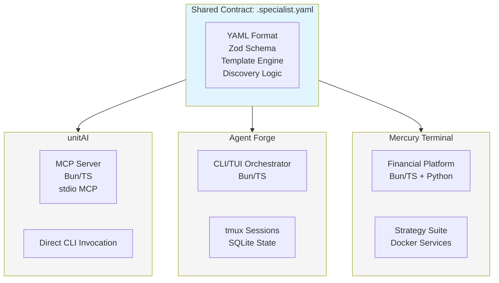
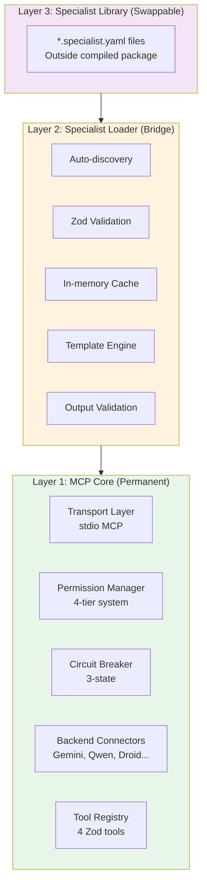
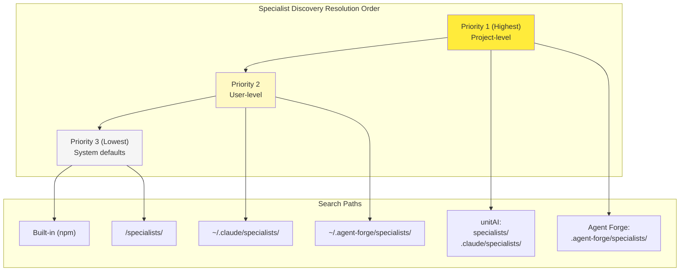
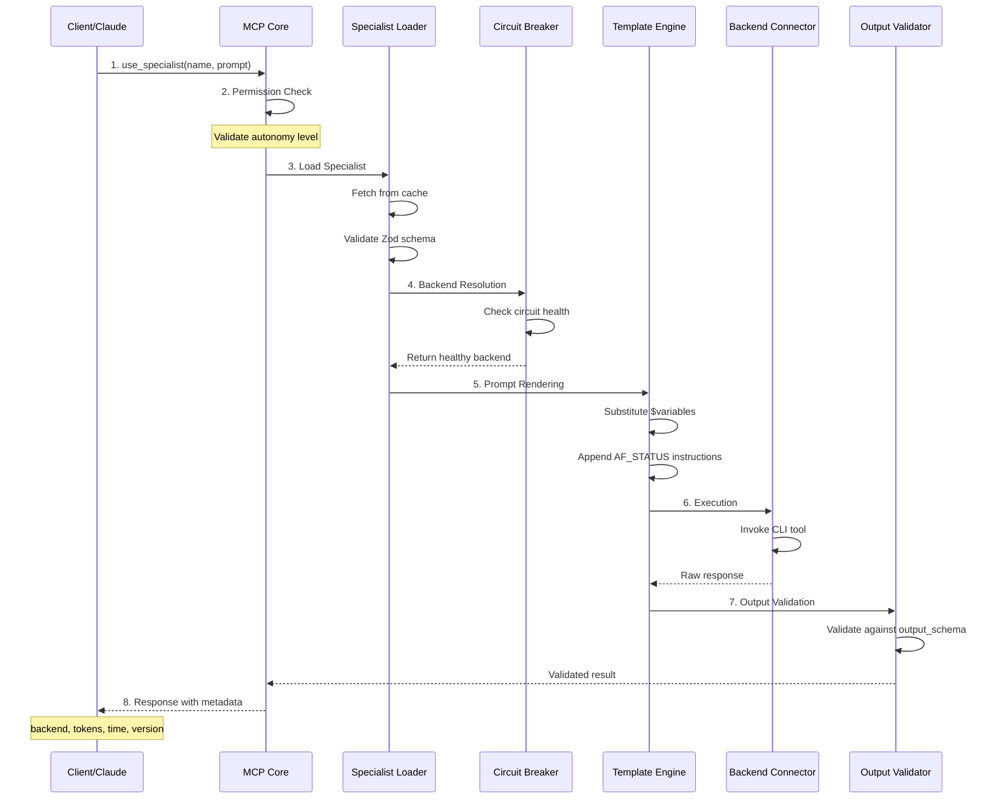
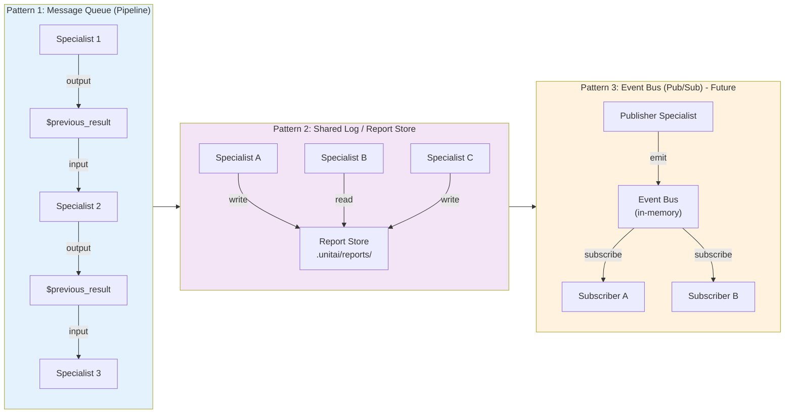
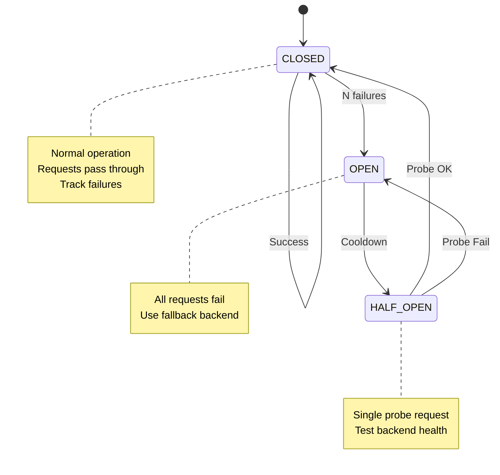
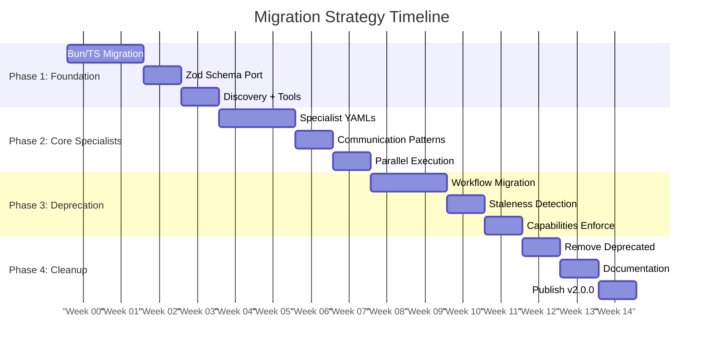
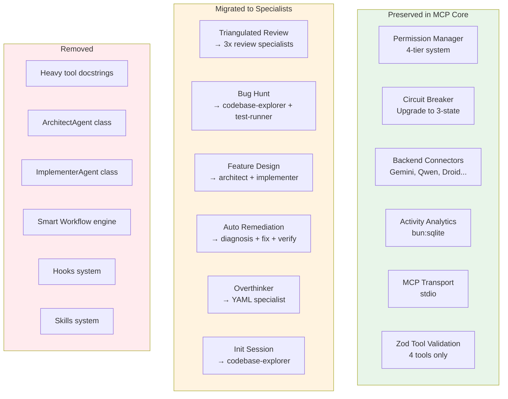

	 
# unitAI v2 -- Specialist System Refactor

> **Version 0.3.0 | DRAFT** Author: Dawid (jagger) | March 2026 Ecosystem: unitAI | Agent Forge | Mercury Terminal Aligned with Agent Forge PRD v1.3.0 and Mercury Terminal Workflow
---

## 1. Executive Summary

This document specifies the architectural refactor of unitAI from a monolithic MCP server with hardcoded workflows into a lean orchestration layer powered by the Specialist System. unitAI is the foundational orchestration layer of a three-tier ecosystem: unitAI (standalone MCP, quick work), Agent Forge (full CLI/TUI orchestrator with tmux sessions), and Mercury Terminal (domain-specific product for financial markets).
All three systems share the Specialist System as their common contract. The `.specialist.yaml` format, Zod validation schema, discovery logic, and template rendering engine are identical across unitAI (TypeScript/MCP), Agent Forge (TypeScript/tmux), and Mercury services (Python/Docker). This document defines unitAI's implementation while maintaining strict compatibility with the broader ecosystem.
### 1.1 Ecosystem Context
|System|Role|Runtime|Specialist Usage|
|---|---|---|---|
|unitAI|Standalone MCP server for quick AI orchestration|Bun/TS, stdio MCP (Node-compatible build)|Direct invocation via MCP tools|
|Agent Forge|Full CLI/TUI orchestrator with tmux sessions|Bun/TS, tmux, SQLite|Brain layer for spawned agents (`--specialist` flag)|
|Mercury Terminal|Domain-specific financial analysis product|Bun/TS + Python microservices|Strategy suite specialists + darth_feedor services|
**Shared Contract:** The `.specialist.yaml` format is the integration boundary. A specialist created for Mercury Docker services (Python/Pydantic) works in Agent Forge (TS/Zod) and in unitAI (TS/Zod). A specialist created via unitAI works when loaded by `agent-forge spawn --specialist`. The format is language-agnostic and runtime-agnostic.
### 1.2 Key Objectives
- Reduce MCP tool surface from ~15+ specialized tools to 3-4 generic coordination tools
- Externalize all workflow logic into specialist YAML files
- Preserve battle-tested core: permission system (4 levels), circuit breaker, fallback mechanisms, backend connectors
- Maintain schema compatibility with Agent Forge `specialist-loader.ts` and darth_feedor Python loader
- Enable hot-reload of specialist configurations without rebuilds
- Implement inter-specialist communication aligned with Agent Forge message bus patterns



### 1.3 Success Metrics
|Metric|Current (unitAI v1)|Target (unitAI v2)|
|---|---|---|
|Tool definitions loaded|15+ (all docstrings)|3-4 (lightweight)|
|Token overhead per session|High (all workflows in context)|Minimal (on-demand loading)|
|Workflow modification|Code change + rebuild + npm publish|Edit YAML + restart|
|New workflow creation|TypeScript implementation|YAML file creation|
|Backend selection|Hardcoded per workflow|YAML-defined, overridable|
|Cross-system compatibility|None|Same YAML works in Forge + Mercury|
---

## 2. Architecture Overview
### 2.1 Layer Model
#### Layer 1: MCP Core (Permanent)
Bun/TypeScript within the unitAI npm package. Developed in Bun for consistency with Agent Forge and Mercury Terminal. Distributed via npm with a Node-compatible build (`bun build --target=node`) so users without Bun can still install via `npx`. Contains components that must be reliable and fast.
- **Transport Layer:** stdio MCP server (unchanged)
- **Permission Manager:** 4-tier system (READ_ONLY, LOW, MEDIUM, HIGH). Maps to Agent Forge `capabilities.file_scope` and `capabilities.blocked_tools` when a specialist defines them.
- **Circuit Breaker:** Three-state (CLOSED / HALF_OPEN / OPEN) per backend, consistent with Agent Forge v0.6.0 circuit breaker pattern. Tracks consecutive failures, not just binary up/down.
- **Backend Connectors:** Implementations of the `AgentSession` interface (see §4.4) for each CLI backend — Gemini, Qwen, Droid, Cursor, Rovo. Recommended backing: `@mariozechner/pi` RpcClient thin wrapper. Swappable without touching the specialist loader or tool surface.
- **Tool Registry:** Zod-validated MCP tool definitions (4 tools).
#### Layer 2: Specialist Loader (Bridge)
Runtime component for discovery, validation, caching, and rendering. This component is architecturally identical to Agent Forge's `core/specialist-loader.ts`. Both implement the same Zod schema, same discovery order, same template engine. The goal is eventual extraction into a shared npm package (`@jaggerxtrm/specialist-loader`) once both systems stabilize.
- Auto-discovery: Scans specialist directories recursively for `*.specialist.yaml`
- Validation: Zod schema enforcement at load time (fail-fast). Schema is a superset that includes Agent Forge fields (capabilities, preferred_profile, heartbeat) -- unitAI ignores fields it doesn't use but never rejects them.
- Caching: In-memory cache of parsed configurations for O(1) lookup
- Template Engine: `$variable` substitution in prompt templates (string.Template style)
- Output Validation: JSON schema enforcement on backend responses
#### Layer 3: Specialist Library (Swappable)
The collection of `*.specialist.yaml` files. These live outside the compiled package.



### 2.2 Discovery Resolution Order
Both unitAI and Agent Forge follow the same 3-scope priority order. The directory names differ by context but the precedence logic is identical:

|Priority|unitAI Path|Agent Forge Path|Description|
|---|---|---|---|
|1 (highest)|`specialists/` or `.claude/specialists/`|`.agent-forge/specialists/`|Project-level overrides|
|2|`~/.claude/specialists/`|`~/.agent-forge/specialists/`|User-level defaults|
|3 (lowest)|Built-in (bundled in npm package)|`<install>/specialists/`|System defaults|
**Cross-Discovery:** unitAI also scans `.agent-forge/specialists/` if present, and Agent Forge also scans `.claude/specialists/` if present. This ensures a specialist placed in either location is found by both systems. Project-level always wins over user-level, regardless of directory name.



### 2.3 Data Flow
The complete lifecycle of a specialist invocation in unitAI:



1. **Client Request:** Claude (or user) invokes `use_specialist` via MCP with specialist name and parameters.
2. **Permission Check:** MCP Core validates against current autonomy level. If specialist defines `capabilities.permission_required`, that overrides.
3. **Specialist Load:** Loader fetches from cache. Validates full Zod schema (superset including Agent Forge fields).
4. **Backend Resolution:** `execution.model` -> circuit breaker health check -> `execution.fallback_model` -> global fallback chain. If `backend_override` parameter provided, skip YAML default.
5. **Prompt Rendering:** Template engine substitutes `$variables`. If specialist has `prompt.system`, prepend it. Append AF_STATUS format instructions.
6. **Execution:** Backend connector invokes CLI tool with rendered prompt and execution config.
7. **Output Validation:** Response validated against `prompt.output_schema` if defined.
8. **Response:** Result returned with metadata (backend used, tokens, execution time, specialist version).
---

## 3. MCP Tool Surface

The refactored unitAI exposes exactly 4 MCP tools.
### 3.1 list_specialists
Scans all specialist directories and returns a lightweight catalog. Extracts `metadata.description` from each YAML frontmatter. Token-efficient: never returns full prompts or execution config.
|Property|Value|
|---|---|
|Tool Name|`list_specialists`|
|Permission Level|READ_ONLY|
|Parameters|`category?: string` (filter by category), `scope?: 'project'\|'user'\|'system'\|'all'`|
|Returns|Array of `{ name, description, category, version, model, preferred_profile? }`|
**Scope parameter:** Mirrors Agent Forge CLI: `specialist list --scope project|user|sys`. Allows the agent to understand where each specialist comes from.
### 3.2 use_specialist
Executes a single specialist. Primary tool that handles the complete lifecycle.

|Parameter|Type|Required|Description|
|---|---|---|---|
|name|string|Yes|Specialist identifier (e.g. `codebase-explorer`)
|prompt|string|Yes|The user/agent request to process|
|variables|object|No|Additional template variables for prompt rendering|
|backend_override|string|No|Force a specific backend (bypasses YAML default)|
|autonomy_level|string|No|Override permission level for this invocation|
**Backend Resolution Chain:** (1) `backend_override` param -> (2) `execution.model` from YAML -> (3) `execution.fallback_model` from YAML -> (4) global fallback. Circuit breaker (3-state: CLOSED/HALF_OPEN/OPEN) checked at each step.
**Capabilities Enforcement:** If the specialist defines `capabilities.blocked_tools` or `capabilities.file_scope`, unitAI enforces these as constraints on the execution environment. A specialist with `capabilities.blocked_tools: [Bash]` cannot be invoked with shell access.
### 3.3 run_parallel
Executes multiple specialists concurrently. Returns aggregated results. This maps to Agent Forge's protocol engine for parallel turns but without tmux sessions.

|Parameter|Type|Required|Description|
|---|---|---|---|
|specialists|array|Yes|Array of `{ name, prompt, variables?, backend_override? }`|
|merge_strategy|string|No|`'collect'` (default), `'synthesize'`, `'vote'`|
|timeout_ms|number|No|Max wait for all specialists (default: 120000)|
Merge strategies:
- **collect:** Returns raw array of all results. Client decides how to use them.
- **synthesize:** Feeds all results into a synthesis specialist that produces a unified output. Equivalent to Agent Forge's `result.template` in protocols.
- **vote:** For boolean/categorical outputs, returns majority decision with confidence score.
### 3.4 specialist_status
Returns system health and operational status. Consistent with Agent Forge's `specialist check-health` CLI command.

|Property|Value|
|---|---|
|Tool Name|`specialist_status`|
|Permission Level|READ_ONLY|
|Returns|`{ backends_health, loaded_count, stale_specialists[], cache_stats, recent_executions[] }`|
**Staleness Detection:** Same algorithm as Agent Forge: checks if any `files_to_watch` have mtime > `specialist.metadata.updated`, and if days since update exceeds `stale_threshold_days`. Reports status as OK, STALE, or AGED.
---

## 4. Specialist YAML Schema (Unified)

The specialist schema is the shared contract across the entire ecosystem. unitAI, Agent Forge, and darth_feedor Python services all validate against this schema. The schema is a superset: each system uses the fields relevant to it and ignores the rest. No system ever rejects a valid specialist YAML because it contains fields from another system.
### 4.1 Complete Schema
```yaml
specialist:
  # ─── METADATA (all systems) ───
  metadata:
    name: string              # kebab-case, unique identifier
    version: string            # semver '1.0.0'
    description: string        # Short (shown in list_specialists)
    category: string           # Hierarchical: 'analysis/code'
    author: string
    created: datetime
    updated: datetime
    tags: string[]             # Searchable tags
  # ─── EXECUTION (all systems) ───
  execution:
    mode: string               # 'tool' (MCP/CLI call) | 'skill' (context injection) | 'auto'
    model: string              # Primary backend: gemini|qwen|droid|cursor|rovo
    fallback_model: string     # Fallback if primary unavailable
    temperature: number        # 0.0-2.0 (default: 0.3)
    max_tokens: number         # Response token limit
    timeout_ms: number         # Per-invocation timeout
    response_format: string    # 'text'|'json'|'markdown'
    permission_required: string # Minimum autonomy level
    preferred_profile: string  # [Agent Forge] Which profile to use for spawn
    approval_mode: string      # [Agent Forge] 'auto-edit'|'plan'|'default'|'yolo'
  # ─── PROMPT (all systems) ───
  prompt:
    system: string             # System prompt
    task_template: string      # Main prompt with $variable substitution
    normalize_template: string  # [Mercury] Fix output violations
    output_schema: object      # JSON Schema for output validation
    examples: object[]         # Few-shot examples
    skill_inherit: string      # [Agent Forge] Path to service SKILL.md — appended to agents.md at spawn
                               # Bridges specialist orchestration with service operational knowledge (PRD v1.3.0)
  # ─── SKILLS & ATTACHMENTS (all systems) ───
  skills:
    scripts:                   # Executable scripts
      - path: string
        phase: 'pre'|'post'    # Before or after LLM invocation
        inject_output: boolean # Add script output to prompt vars
    references: object[]       # Links to docs, SSOT, code symbols
    tools: string[]            # MCP tools / names this specialist uses
  # ─── CAPABILITIES (Agent Forge + unitAI) ───
  capabilities:
    file_scope: string[]       # Filesystem access boundaries
    blocked_tools: string[]    # Tools this specialist must NOT use
    can_spawn: boolean         # Can spawn sub-agents (Agent Forge)
    tools:                     # Named tools with purpose
      - name: string
        purpose: string
    diagnostic_scripts:        # [Agent Forge] Executable scripts from service skills (health_probe.py, etc.)
      - string                 # Paths documented in agents.md as available tools (PRD v1.3.0)
  # ─── COMMUNICATION (unitAI + Agent Forge) ───
  communication:
    publishes: string[]        # Event topics this specialist emits
    subscribes: string[]       # Event topics it listens to
    output_to: string          # File path or topic for results
  # ─── VALIDATION (all systems) ───
  validation:
    files_to_watch: string[]   # Trigger staleness if these change
    references: object[]       # SSOT docs, code refs
    stale_threshold_days: int  # Max days before flagged as AGED
  # ─── HEARTBEAT (Agent Forge future / Mercury future) ───
  heartbeat:
    enabled: boolean
    interval: string           # Cron-like: '15m', '1h'
    on_wake: string[]          # Actions on wake
    on_issue: string[]         # Actions on problem detected
```
### 4.2 Field Ownership Matrix
Each field is used by one or more systems. No system rejects unknown fields.

|Field|unitAI|Agent Forge|Mercury/Python|
|---|---|---|---|
|metadata.*|Used|Used|Used|
|execution.mode|Used (tool/skill/auto)|Used (tool/skill/auto)|Ignored (always tool)|
|execution.model/fallback/temp/tokens|Used|Used|Used|
|execution.preferred_profile|Ignored|Used (spawn profile)|Ignored|
|execution.approval_mode|Ignored|Used (agent mode)|Ignored|
|prompt.system/task_template/output_schema|Used|Used|Used|
|prompt.normalize_template|Ignored|Ignored|Used (Mercury)|
|skills.scripts|Used (pre/post)|Used (pre/post)|Planned|
|skills.references|Used (context)|Used (context)|Used|
|capabilities.*|Enforced|Enforced|N/A|
|communication.*|Used (v2.0)|Used (message bus)|N/A|
|validation.*|Used (staleness)|Used (staleness)|Used|
|heartbeat.*|Ignored|Planned (v1.4)|Planned|
### 4.3 Execution Mode: tool vs skill vs auto
`execution.mode` determines how the specialist is used at runtime. This reflects the current industry trend where context injection (skills/CLAUDE.md) is increasingly preferred over tool calls for domain knowledge, while tool calls remain appropriate for discrete tasks that require a separate backend invocation.
- **tool (default):** The specialist is invoked as a discrete operation. unitAI calls the backend CLI/MCP, waits for a response, validates output. Full lifecycle hooks fire. This is the primary mode for unitAI and the focus of this spec.
- **skill:** The specialist's `prompt.system` is injected directly into the agent's context (CLAUDE.md, system prompt, or equivalent). No backend call happens. The specialist acts as domain knowledge, not as a task executor. Agent Forge already does this when writing specialist prompts to session-scoped CLAUDE.md files.
- **auto:** The system decides based on context. If the caller is an interactive agent session (Agent Forge tmux), skill mode is preferred (inject knowledge). If the caller is a programmatic MCP call (unitAI), tool mode is used. This is the recommended default for most specialists.
The relationship between specialists and skills is fluid. Agent Forge's PRD defines three knowledge layers: Rules (always-on constraints), Skills (on-demand procedures), Specialists (domain expert config). A specialist in skill mode behaves like a skill with structure, validation, and versioning. The skill-to-specialist promotion path (`agent-forge specialist create --from-skill`) and the specialist-in-skill-mode are two sides of the same coin.

### 4.4 AgentSession Interface (Execution Substrate)

The Backend Connectors in Layer 1 implement a common `AgentSession` interface. This decouples the specialist execution pipeline from any specific underlying library, while allowing the recommended implementation (`@mariozechner/pi` RpcClient) to be swapped without touching the specialist loader or tool surface.

```typescript
/**
 * AgentSession: minimal contract for spawning and monitoring a CLI agent.
 * Implemented by each backend connector (PiAgentSession, DirectApiSession, etc.)
 */
interface AgentSession {
  /** Send a prompt and begin execution. Resolves when the agent accepts the input. */
  prompt(task: string): Promise<void>;

  /** Wait until the agent finishes its current turn (no active tool calls, no output). */
  waitForIdle(timeoutMs?: number): Promise<void>;

  /** Return the last assistant text block from this session. */
  getLastOutput(): string;

  /** Terminate the session and clean up resources. */
  kill(): void;

  /** Session metadata (backend, model, sessionId). */
  readonly meta: AgentSessionMeta;
}

interface AgentSessionMeta {
  backend:   string;   // 'google-gemini-cli' | 'anthropic' | 'openai' | ...
  model:     string;
  sessionId: string;
  startedAt: Date;
}
```

**Recommended implementation — pi thin wrapper:**

`@mariozechner/pi` (RpcClient) is the recommended backing implementation for Bun/TS systems. It handles process lifecycle, JSON event streaming, idle detection, and provider-specific protocol differences (Claude Code `--output-format stream-json`, Gemini CLI, Qwen DashScope, etc.) for all CLI backends.

The wrapper is thin — unitAI defines the `AgentSession` interface above, pi does the work:

```typescript
import { RpcClient } from '@mariozechner/pi';

class PiAgentSession implements AgentSession {
  private client: RpcClient;

  constructor(provider: string, cwd: string) {
    this.client = new RpcClient({ provider, cwd });
  }

  async prompt(task: string)           { await this.client.prompt(task); }
  async waitForIdle(ms?: number)       { await this.client.waitForIdle(ms); }
  getLastOutput(): string              { return this.client.get_last_assistant_text(); }
  kill(): void                         { this.client.kill(); }

  readonly meta: AgentSessionMeta = { /* ... */ };
}
```

**Why this boundary matters:**

If `@mariozechner/pi` changes its API, only `PiAgentSession` changes — not the specialist loader, not the tool surface, not the YAML schema. A future `DirectApiSession` (calling Claude/Gemini APIs directly without a CLI) would implement the same interface, enabling unitAI to support non-CLI backends without any changes to the orchestration layer.

**execution.mode mapping through AgentSession:**

| `execution.mode` | How AgentSession is used |
|-----------------|--------------------------|
| `tool` | Create session, `prompt(task)`, `waitForIdle()`, `getLastOutput()`, `kill()` |
| `skill` | No AgentSession created — system prompt injected into caller's context directly |
| `auto` | MCP call context → `tool` mode; interactive session context → `skill` mode |

---

## 5. Inter-Specialist Communication

unitAI implements a subset of Agent Forge's communication infrastructure. Agent Forge has the full message bus (SQLite messages table, tmux pipe, file logs). unitAI implements lighter-weight patterns suitable for stateless MCP invocations.
### 5.1 Agent Forge Message Schema (Reference)
Agent Forge defines this SQLite messages table. unitAI does not replicate it (no SQLite for messages), but its communication patterns must be compatible when a specialist is later loaded in Agent Forge:
```sql
-- Agent Forge messages table (reference, not implemented in unitAI)
CREATE TABLE messages (
  id            INTEGER PRIMARY KEY AUTOINCREMENT,
  from_session  TEXT NOT NULL,
  to_session    TEXT NOT NULL,
  type          TEXT NOT NULL CHECK(type IN (
    'task','result','status','follow_up',
    'worker_done','spawn_request','escalation','health_check')),
  content       TEXT NOT NULL,
  payload       TEXT,  -- JSON structured data
  priority      TEXT DEFAULT 'normal'
    CHECK(priority IN ('low','normal','high','urgent')),
  thread_id     TEXT,
  created_at    DATETIME DEFAULT CURRENT_TIMESTAMP,
  read          BOOLEAN DEFAULT FALSE
);
```
### 5.2 Communication Architecture: Current Design and Future Evolution
The current Agent Forge design uses tmux for both execution (spawn, isolate, persist) and output reading (capture-pane, pipe-pane, AF_STATUS from log files). This works but creates a dependency on terminal parsing for structured communication.
**Current design (maintained for now):**
- tmux manages session lifecycle and serves as execution layer
- Output capture via `pipe-pane` to log files
- AF_STATUS block parsed from log files (not from capture-pane, avoiding scrollback issues)
- SQLite messages table for inter-agent task assignment and coordination
**Future evolution (annotated for Agent Forge v1.3.0+):** The ideal separation is: tmux as pure execution layer (spawn, isolate, persist, detach/attach) and SQLite as the sole communication layer (messages, status, results). Agents would never communicate by reading each other's terminal output. All structured communication would flow through SQLite, accessed via a local MCP server that wraps `state.db` operations as typed tools:
```typescript
// Future: Local communication MCP server tools
send_message({ to, type, content, payload?, priority? })
read_inbox({ session_id, unread_only?, type_filter? })
update_status({ session_id, status, last_activity? })
report_completion({ session_id, af_status, artifacts? })
get_task({ session_id })
```
Each CLI agent's native hook system (Claude Code hooks, Gemini SDK events, etc.) would call this MCP server transparently. The agent wouldn't need to know it's being orchestrated. tmux `capture-pane` would be demoted to debug/backup, and `pipe-pane` logs would serve as audit trail only.
**Open research:** Each CLI's hook system needs individual study. Claude Code has 8 official hook types. Gemini CLI's SDK exposes lifecycle events but deployment differs. Qwen and GLM CLIs may need a wrapper approach.
### 5.3 unitAI Communication Patterns
#### Pattern 1: Message Queue (Pipeline)
Sequential pipeline where one specialist's output feeds the next. The MCP coordinator manages the queue in-memory. Each specialist receives `$previous_result` as a template variable. This maps to Agent Forge's protocol turns with `capture_output` + `output_var`.
**Priority:** v2.0 (first implementation)
#### Pattern 2: Shared Log / Report Store
Filesystem-based report store. Specialists write structured reports to a known directory. Compatible with Agent Forge's `.agent-forge/sessions/{id}/` pattern and Mercury's `.unitai/reports/` convention.
```
.unitai/reports/          # unitAI default
.agent-forge/reports/     # Agent Forge default (also scanned by unitAI)
```
**Priority:** v2.0 (second implementation)
#### Pattern 3: Event Bus (Pub/Sub)
In-memory event system using the `communication.publishes` and `communication.subscribes` fields. Events are typed (topic + payload). This aligns with Agent Forge's JSONL event bridge (v0.6.0) for observability.
**Priority:** v2.1 (deferred, matches Agent Forge v0.6.0 timeline)



### 5.4 AF_STATUS Block Protocol
Agent Forge defines a structured completion signal (AF_STATUS) that specialists emit at task completion. unitAI implements full AF_STATUS parsing, identical to Agent Forge. This ensures a specialist behaves consistently regardless of which system executes it. When `use_specialist` renders a prompt, it appends AF_STATUS format instructions to `prompt.system` automatically.
```
---AF_STATUS---
STATUS: COMPLETE | IN_PROGRESS | BLOCKED
EXIT_SIGNAL: true | false
PROGRESS_SUMMARY: <one-line summary>
ARTIFACTS: <comma-separated outputs, or 'none'>
BLOCKED_REASON: <if BLOCKED, reason>
---AF_STATUS_END---
```
Both unitAI and Agent Forge parse the full block. unitAI reads it from the backend CLI response. Agent Forge reads it from the session log file (avoids scrollback truncation). The parsing logic is identical and will be part of the shared `@jaggerxtrm/specialist-loader` package.
---

## 6. Specialist Lifecycle Hooks

Every specialist invocation passes through 4 hook points that trace the complete cycle from request to response. The hook schema is shared across unitAI and Agent Forge; only the sink differs (JSONL file vs SQLite). This system provides full observability over specialist execution, enables cost tracking, debugging, and audit trails.
### 6.1 Hook Points
The 4 hooks fire in strict sequence during every specialist invocation. Each emits a structured event with a shared correlation ID (`invocation_id`) that ties all events from a single specialist call together.

|Hook|Fires When|Key Payload Fields|Use Cases|
|---|---|---|---|
|`pre_render`|Specialist loaded from cache, template variables resolved|specialist_name, version, variables (keys only), backend_resolved|Audit which specialist was selected, verify variable availability|
|`post_render`|Prompt fully rendered, ready for execution|prompt_hash, prompt_length_chars, system_prompt_present, af_status_appended|Debug prompt construction, detect oversized prompts, token estimation|
|`pre_execute`|Prompt about to be sent to backend CLI|backend, model, temperature, max_tokens, timeout_ms, approval_mode|Track backend selection, circuit breaker state at invocation time|
|`post_execute`|Response received and validated|status (from AF_STATUS), duration_ms, tokens_in, tokens_out, output_valid, error?|Cost tracking, latency monitoring, success/failure rates, debugging|
### 6.2 Event Schema
Every hook event follows the same base schema. Hook-specific fields extend the base. The schema is identical in unitAI (JSONL) and Agent Forge (SQLite row).
```typescript
// Base event (all 4 hooks)
{
  invocation_id: string,     // UUID, same for all 4 events in one call
  hook: 'pre_render' | 'post_render' | 'pre_execute' | 'post_execute',
  timestamp: string,         // ISO 8601
  specialist_name: string,
  specialist_version: string,
  session_id?: string,       // Agent Forge session ID (null in unitAI)
  thread_id?: string,        // For pipeline/parallel correlation
}
// pre_render extends base with:
{
  variables_keys: string[],  // Template variable names (not values, for security)
  backend_resolved: string,  // Which backend was selected
  fallback_used: boolean,    // Was fallback triggered by circuit breaker?
  circuit_breaker_state: 'CLOSED' | 'HALF_OPEN' | 'OPEN',
  scope: 'project' | 'user' | 'system',  // Where specialist was discovered
}
// post_render extends base with:
{
  prompt_hash: string,       // SHA-256 of rendered prompt (not the prompt itself)
  prompt_length_chars: number,
  estimated_tokens: number,  // Rough estimate for cost projection
  system_prompt_present: boolean,
  af_status_appended: boolean,
}
// pre_execute extends base with:
{
  backend: string,           // 'gemini', 'qwen', 'droid', etc.
  model: string,             // Specific model string
  temperature: number,
  max_tokens: number,
  timeout_ms: number,
  permission_level: string,  // Active permission level
  capabilities_enforced: {   // Active constraints
    file_scope?: string[],
    blocked_tools?: string[],
  },
}
// post_execute extends base with:
{
  status: 'COMPLETE' | 'IN_PROGRESS' | 'BLOCKED' | 'ERROR',
  duration_ms: number,
  tokens_in: number,         // Input tokens (from backend response)
  tokens_out: number,        // Output tokens
  output_valid: boolean,     // Passed output_schema validation?
  af_status_parsed: boolean, // AF_STATUS block found and parsed?
  af_status_fields?: {       // Parsed AF_STATUS content
    progress_summary: string,
    artifacts: string,
    blocked_reason?: string,
  },
  error?: {                  // Only on failure
    type: 'timeout' | 'backend_error' | 'validation_failed' | 'circuit_open',
    message: string,
  },
  cost_estimate?: {          // Derived from tokens + model pricing
    model: string,
    input_cost_usd: number,
    output_cost_usd: number,
    total_cost_usd: number,
  },
}
```
### 6.3 Sink Strategy
The hook system writes to different sinks depending on the runtime. The event schema is identical; only the storage mechanism changes.

|System|Sink|Format|Location|Queryable|
|---|---|---|---|---|
|unitAI|JSONL file (append-only)|One JSON line per event|`.unitai/trace.jsonl`|grep, jq, tail -f|
|Agent Forge|SQLite table + JSONL|Row per event + JSONL mirror|`state.db` + `.agent-forge/trace.jsonl`|SQL queries + jq|
|Mercury Terminal|SQLite (via Agent Forge)|Inherits Forge behavior|`agent-forge/state.db`|SQL queries|
#### unitAI: JSONL File
unitAI appends one JSON line per hook event to `.unitai/trace.jsonl`. The file is append-only and never read by unitAI during normal operation. It exists purely for observability and debugging. File rotation (by date or size) is the user's responsibility.
```jsonl
{"invocation_id":"a1b2c3","hook":"pre_render","timestamp":"2026-03-03T14:23:01Z",...}
{"invocation_id":"a1b2c3","hook":"post_render","timestamp":"2026-03-03T14:23:01Z",...}
{"invocation_id":"a1b2c3","hook":"pre_execute","timestamp":"2026-03-03T14:23:01Z",...}
{"invocation_id":"a1b2c3","hook":"post_execute","timestamp":"2026-03-03T14:23:15Z",...}
```
#### Agent Forge: SQLite Table
Agent Forge writes to a `specialist_events` table in `state.db`. This enables SQL queries for cost aggregation, latency percentiles, error rate by specialist, and cross-session analysis.
```sql
CREATE TABLE specialist_events (
  id              INTEGER PRIMARY KEY AUTOINCREMENT,
  invocation_id   TEXT NOT NULL,
  hook            TEXT NOT NULL CHECK(hook IN (
    'pre_render','post_render','pre_execute','post_execute')),
  timestamp       DATETIME NOT NULL,
  specialist_name TEXT NOT NULL,
  specialist_version TEXT,
  session_id      TEXT,          -- links to sessions table
  thread_id       TEXT,          -- links to messages.thread_id
  payload         TEXT NOT NULL,  -- Full event JSON
  -- Denormalized for fast queries:
  backend         TEXT,
  duration_ms     INTEGER,
  tokens_in       INTEGER,
  tokens_out      INTEGER,
  cost_usd        REAL,
  status          TEXT,
  error_type      TEXT
);
CREATE INDEX idx_events_invocation ON specialist_events(invocation_id);
CREATE INDEX idx_events_specialist ON specialist_events(specialist_name, timestamp);
CREATE INDEX idx_events_session    ON specialist_events(session_id);
```
### 6.4 Cost Tracking (Derived)
Every `post_execute` event contains token counts and model identifier. Combined with a pricing table, this enables automatic cost tracking per specialist, per backend, per session. This aligns with Mercury Terminal's cost-aware model selection (GLM $0.05/MTok through Opus $15/MTok).
```typescript
// Pricing table (configurable, default values)
const MODEL_PRICING = {
  'glm-4':           { input: 0.05,  output: 0.10  },  // $/MTok
  'gemini-2.5-lite': { input: 0.075, output: 0.15  },
  'haiku':           { input: 0.40,  output: 2.00  },
  'gemini-pro':      { input: 1.25,  output: 5.00  },
  'sonnet':          { input: 3.00,  output: 15.00 },
  'opus':            { input: 15.00, output: 75.00 },
};
```
```sql
-- Example: Cost per specialist (last 24h)
SELECT specialist_name, SUM(cost_usd) as total_cost,
  COUNT(*) as invocations, AVG(duration_ms) as avg_latency
FROM specialist_events
WHERE hook = 'post_execute'
  AND timestamp > datetime('now', '-24 hours')
GROUP BY specialist_name ORDER BY total_cost DESC;
```
### 6.5 Hook Registration and Extension
The hook system is extensible. Users and specialists can register custom hook handlers that fire alongside the default sink. This enables integration with external observability systems (Prometheus, Grafana, custom dashboards).
```typescript
// Register a custom hook handler (unitAI)
loader.onHook('post_execute', async (event) => {
  // Send to Prometheus pushgateway
  await prometheus.push('specialist_duration_ms', event.duration_ms, {
    specialist: event.specialist_name,
    backend: event.backend,
  });
});
```
Hook handlers are fire-and-forget: they never block the specialist execution pipeline. If a handler throws, the error is logged but execution continues.
---

## 7. Predefined Specialists

unitAI ships with generic, domain-agnostic specialists. Mercury provides domain-specific specialists. Agent Forge inherits both.
### 7.1 Built-in (unitAI)
|Specialist|Backend|Permission|Category|Purpose|
|---|---|---|---|---|
|codebase-explorer|gemini (fb: qwen)|READ_ONLY|analysis/code|Project structure, dependencies, architecture analysis|
|test-runner|droid (fb: qwen)|MEDIUM|testing/validation|Test execution, coverage, failure diagnosis, fix suggestions|
|report-generator|gemini (fb: qwen)|LOW|documentation/reporting|Synthesis from multiple sources, changelogs, health dashboards|
### 7.2 Mercury Domain Specialists (Reference)
These are defined in Mercury Terminal's `.agent-forge/specialists/` directory. Listed here for awareness; they are not bundled with unitAI but work seamlessly when unitAI runs in a Mercury project.

|Specialist|Backend|Category|Purpose|
|---|---|---|---|
|mercury-db-health|gemini|monitoring/database|PostgreSQL health, connection pools, replication lag|
|mercury-strategy-researcher|gemini|strategy/research|Data collection, cross-check, RESEARCHER_OUTPUT production|
|mercury-strategy-developer|qwen|strategy/development|Correlation analysis, strategy candidate generation|
|mercury-strategy-documentor|gemini|strategy/documentation|Docs maintenance, diff monitoring, version tracking|
|mercury-strategy-backtester|droid|strategy/validation|Backtesting, performance metrics, BACKTEST_REPORT production|

### 7.3 codebase-explorer Detail
The primary built-in specialist. Replaces unitAI v1's init-session workflow and parts of ArchitectAgent.
- **Backend:** gemini (large context window for full directory ingestion). Fallback: qwen.
- **Capabilities:** `file_scope: ['.']` (full project read), `blocked_tools: [Bash]` (read-only), `can_spawn: false`
- **Output:** JSON with `{ summary, findings[], recommendations[], dependency_graph? }`
- **Attached skills:** File tree scanning, git history analysis, import graph resolution
- **Communication:** `publishes: ['analysis.complete']`, `output_to: '.unitai/reports/analysis-latest.json'`
### 7.4 test-runner Detail
Health check specialist with attached scripts. Replaces unitAI v1's code-validation skill and auto-remediation.
- **Backend:** droid (operational tasks). Fallback: qwen.
- **Permission:** MEDIUM (needs to run scripts, access test frameworks)
- **Scripts:** `scripts/run-tests.sh` (phase: pre, inject_output: true), `scripts/coverage-report.sh` (phase: post)
- **Output:** JSON test results + Markdown human-readable report
- **Report output:** `.unitai/reports/test-results-{date}.json`
---

## 8. Permission and Capabilities Model

unitAI's 4-tier permission system composes with the specialist YAML capabilities field. The permission system is the invariant layer (like Agent Forge's Rules layer); specialist capabilities are additive constraints.
### 8.1 Permission Levels
|Level|unitAI Operations|Agent Forge Equivalent|
|---|---|---|
|READ_ONLY|Analysis, file reads, git status|Default level, no file modifications|
|LOW|File writes within project directory|File modifications within project|
|MEDIUM|Git operations, dependency management, script execution|Local git ops, npm/pip|
|HIGH|External API calls, git push, publish|Full autonomy|
### 8.2 Capabilities Composition
When a specialist defines capabilities, they act as further restrictions on top of the session's permission level. They never grant more access than the permission level allows.
- **file_scope:** If defined, the specialist can only access files matching these paths. Enforced by the loader before passing context to the backend.
- **blocked_tools:** Tools the specialist must not use, regardless of permission level. E.g., a monitoring specialist with `blocked_tools: [Bash]` cannot execute shell commands even at MEDIUM permission.
- **can_spawn:** Agent Forge specific. If false, the specialist cannot request sub-agent spawning. unitAI ignores this field (no spawn concept in MCP).
---

## 9. Circuit Breaker and Fallback

Both unitAI and Agent Forge implement the same 3-state circuit breaker pattern. This section defines the shared behavior.
### 9.1 Three-State Model
|State|Behavior|Transition|
|---|---|---|
|CLOSED|Normal operation, requests pass through. Track consecutive failures.|-> OPEN after N consecutive failures (default: 3)|
|OPEN|All requests to this backend fail immediately. Use fallback.|-> HALF_OPEN after cooldown period (default: 60s)|
|HALF_OPEN|Allow one probe request. If success: CLOSED. If fail: OPEN.|-> CLOSED on success, -> OPEN on failure|



### 9.2 Fallback Chain
When the primary backend's circuit breaker is OPEN, the system follows this resolution:
1. `execution.fallback_model` from specialist YAML
2. Global fallback chain configured in unitAI settings
3. If all backends are OPEN: return error with diagnostic information
**Agent Forge extension:** Agent Forge adds git-diff based progress detection to the circuit breaker. If N cycles produce no file modifications, artifacts, or git commits, the circuit opens. unitAI does not implement this (no session persistence), but the circuit breaker interface is compatible.
---

## 10. Migration Strategy

Incremental refactor. unitAI continues to function throughout migration. No big-bang rewrite.



### 10.1 Phase 1: Foundation (Week 1-2)
- Migrate unitAI build system from Node/tsc to Bun (`bunfig.toml`, `bun build --target=node` for npm distribution)
- Replace `better-sqlite3` with `bun:sqlite` for activity analytics
- Port SpecialistLoader from Python (Pydantic) to TypeScript (Zod)
- Implement unified Zod schema (superset: all fields from unitAI + Agent Forge + Mercury)
- Add 3-scope discovery with cross-scanning (`.claude/` + `.agent-forge/`)
- Implement `list_specialists` and `use_specialist` MCP tools
- Wire into existing backend connectors and circuit breaker (upgrade to 3-state)
- Implement full AF_STATUS block parsing (identical to Agent Forge)
- Write `codebase-explorer.specialist.yaml`
### 10.2 Phase 2: Core Specialists + Communication (Week 3-4)
- Create `test-runner.specialist.yaml` with attached scripts
- Create `report-generator.specialist.yaml`
- Implement `run_parallel` tool
- Implement Message Queue pipeline pattern
- Implement Shared Log / report store (`.unitai/reports/`)
- Implement AF_STATUS block parsing
- Migrate triangulated-review workflow to parallel specialists
### 10.3 Phase 3: Deprecation + Staleness (Week 5-6)
- Convert remaining workflows (bug-hunt, overthinker, feature-design) to specialists
- Add deprecation warnings to old workflow tools
- Implement `specialist_status` tool with staleness detection
- Implement capabilities enforcement (`file_scope`, `blocked_tools`)
- Comprehensive testing of all migrated workflows
### 10.4 Phase 4: Cleanup + Publish (Week 7-8)
- Remove deprecated code (old workflows, heavy docstrings, ArchitectAgent, ImplementerAgent)
- Slim tool registry to 4 tools
- Update npm package (`@jaggerxtrm/unitai` v2.0.0)
- Update README, CLAUDE.MD, installation guides
- Performance benchmark: token usage before/after
- Validate cross-compatibility: same specialist YAML in unitAI, Agent Forge, darth_feedor
---

## 11. Component Disposition



### 11.1 Preserved in MCP Core
|Component|Current Location|Action|
|---|---|---|
|Permission Manager (4 levels)|`permissionManager.ts`|Keep, add capabilities composition|
|Circuit Breaker|`circuitBreaker.ts`|Upgrade to 3-state (CLOSED/HALF_OPEN/OPEN)|
|Backend Connectors|gemini/qwen/droid executors|Keep, add unified interface for specialist execution|
|Activity Analytics (SQLite)|`activityAnalytics.ts`|Keep, extend with specialist metadata|
|MCP Transport (stdio)|`index.ts`|Keep as-is|
|Zod Tool Validation|`tools/registry.ts`|Keep, reduce to 4 tools|
### 11.2 Migrated to Specialists
|Workflow|Agent Forge Equivalent|New Specialist(s)|
|---|---|---|
|Triangulated Review|adversarial protocol|3x review specialists + `run_parallel`|
|Bug Hunt|troubleshoot protocol|codebase-explorer + test-runner pipeline|
|Feature Design|collaborative protocol|architect + implementer specialists|
|Auto Remediation|N/A (specialist chain)|diagnosis + fix + verify chain|
|Overthinker|N/A (standalone)|`overthinker.specialist.yaml` (self-contained)|
|Init Session|`agent-forge start`|codebase-explorer with git-history mode|
|Parallel Review|run protocol|`run_parallel` with review specialists|
### 11.3 Removed
|Component|Reason|Replacement|
|---|---|---|
|Heavy tool docstrings|Token waste|Specialist `metadata.description` (lightweight)|
|ArchitectAgent class|Hardcoded logic|Specialist YAML with `model: gemini`|
|ImplementerAgent class|Hardcoded logic|Specialist YAML with `model: droid`|
|Smart Workflow engine|Rigid|Specialist pipelines + Agent Forge protocols|
|Hooks system (current)|Coupled|Specialist communication + Agent Forge hooks|
|Skills system (current)|Heavyweight|Specialist `skills` field|
---

## 12. Ecosystem Integration Points

This section maps the exact integration points between unitAI, Agent Forge, and Mercury Terminal and defines the technology alignment decisions that ensure consistency.
### 12.1 Technology Alignment Matrix
Every technology choice has been aligned across the ecosystem.

|Technology|unitAI|Agent Forge|Mercury Terminal|Status|
|---|---|---|---|---|
|Runtime|Bun/TS|Bun/TS|Bun/TS (+ Python microservices)|ALIGNED|
|Distribution|npm (`bun build --target=node`)|npm (`bun build --target=node`)|Private / Docker|ALIGNED|
|Schema Validation|Zod|Zod|Pydantic (Python) + Zod (TS)|ALIGNED (manual conformance)|
|YAML Format|`.specialist.yaml` (superset)|`.specialist.yaml` (superset)|`.specialist.yaml` (superset)|ALIGNED|
|SQLite|`bun:sqlite` (analytics only)|`bun:sqlite` (sessions + messages)|`bun:sqlite` (mercury.db) + pg|ALIGNED (bun:sqlite native)|
|Circuit Breaker|3-state per-backend|3-state + git-diff progress|3-state (worker level)|ALIGNED (same interface)|
|AF_STATUS Parsing|Full (identical to Forge)|Full (from log files)|Full (worker completion)|ALIGNED|
|Template Engine|`$variable` substitution|`$variable` substitution|`$variable` (Python Template)|ALIGNED (same syntax)|
|Discovery Order|project > user > system|project > user > system|Docker volume > system|ALIGNED (same precedence)|
|Permission Model|4-tier (READ_ONLY..HIGH)|4-tier + capabilities|4-tier + capabilities|ALIGNED (superset)|
|Test Framework|Vitest (via Bun)|Vitest (via Bun)|pytest (Python) + Vitest|ALIGNED|
|Package Manager|bun install|bun install|bun + pip|ALIGNED|
### 12.2 Runtime Decision: Bun/TS
unitAI v2 migrates from Node/TS to Bun/TS, aligning with Agent Forge and Mercury Terminal. Key benefits for this ecosystem:
- **Native TypeScript:** No tsc compilation step. Direct `.ts` execution. Halves the edit-run cycle during specialist development.
- **bun:sqlite built-in:** Eliminates `better-sqlite3` native compilation dependency. All three systems use the same SQLite driver with zero external deps.
- **Fast startup:** Bun process startup is significantly faster than Node. Relevant for Agent Forge which spawns processes frequently. Less relevant for unitAI (persistent MCP server) but eliminates runtime divergence.
- **Package manager:** `bun install` is 5-10x faster than npm. Benefits monorepo workflows if specialist-loader is extracted as shared package.
- **Distribution compatibility:** `bun build --target=node` produces a Node-compatible bundle. Users install via `npx -y @jaggerxtrm/unitai` as before. No Bun required on user machines.
### 12.3 Schema Conformance Strategy
The `.specialist.yaml` schema is validated by Zod (unitAI, Agent Forge) and Pydantic (darth_feedor Python services). Cross-language conformance is maintained through documentation, not automated tests. The schema is documented in this spec (Section 4) as the canonical reference. Each implementation must:
- Accept all fields defined in the superset schema without error
- Ignore fields it does not use (never reject unknown fields)
- Apply the same default values where specified
- Enforce the same regex patterns on `metadata.name` (kebab-case) and `metadata.version` (semver)
If a divergence is discovered in production, the Zod implementation is authoritative (as it covers two of three systems). The Pydantic implementation adapts.
### 12.4 Shared Components
|Component|unitAI Implementation|Agent Forge Implementation|Shared Contract|
|---|---|---|---|
|Specialist Loader|Bun/TS, in-process, MCP lifecycle|Bun/TS, `core/specialist-loader.ts`|Same Zod schema, same discovery order|
|Circuit Breaker|3-state, per-backend|3-state, per-backend + git-diff progress|Same state machine interface|
|AF_STATUS Parser|Full parse from CLI response|Full parse from log file|Same parsing logic, same block format|
|Template Engine|`$variable` substitution|`$variable` substitution + AF_STATUS append|Same Template syntax|
|Output Validation|JSON Schema check|JSON Schema + AF_STATUS check|Same schema format|
|Staleness Detection|`files_to_watch` + threshold|`files_to_watch` + threshold + CLI|Same algorithm|
### 12.5 unitAI as Agent Forge Subcomponent
When Agent Forge spawns an agent with `--specialist`, it uses the same specialist loader as unitAI. The key differences:
- **Execution:** unitAI invokes backends directly (CLI call, wait for response). Agent Forge invokes via tmux session (persistent, monitorable).
- **State:** unitAI is stateless per MCP call. Agent Forge maintains session state in `bun:sqlite`.
- **Communication:** unitAI uses in-memory pipeline/event bus. Agent Forge uses SQLite messages + tmux pipe.
- **Prompt delivery:** unitAI passes full rendered prompt as CLI argument. Agent Forge writes specialist system prompt to `.agent-forge/sessions/{uuid}/CLAUDE.md` and passes only the task via CLI.
- **AF_STATUS:** Both parse the full block. unitAI reads from stdout. Agent Forge reads from log file. Parsing logic is identical.
### 12.6 Mercury Terminal Integration
Mercury Terminal is the domain product built on top of Agent Forge. It defines domain-specific specialists (strategy suite) and workflow (cognitive loop, memory compression, market monitoring). Mercury specialists use the same `.specialist.yaml` format and work in unitAI for quick one-off tasks.
The two databases coexist with separate responsibilities: `agent-forge/state.db` (`bun:sqlite`) for session liveness and parentage; `mercury.db` (`bun:sqlite`) for cognitive context, memory, and artifacts. Correlation between the two via shared `task_ref` UUID in Agent Forge message payloads and Mercury artifact fields.
### 12.7 Future: Shared Package Extraction
Once both unitAI and Agent Forge stabilize their specialist loader implementations, the shared logic should be extracted into `@jaggerxtrm/specialist-loader` (npm package) containing: Zod schema definitions, discovery logic (3-scope, cross-scanning), template engine, AF_STATUS parser, output validator, staleness detector. Both unitAI and Agent Forge would then depend on this package. Since both are now Bun/TS, the package is a straightforward extraction with no runtime compatibility concerns.
---

## 13. Open Questions

Items resolved in v0.3.0: Runtime (Bun/TS, decided), AF_STATUS parsing (full, identical to Forge), Schema conformance (manual alignment, Zod authoritative). Remaining open items:
1. **Shared Package Timeline:** When to extract `@jaggerxtrm/specialist-loader`? After unitAI v2.0? After Agent Forge v0.4.0? Develop in parallel from day one?
2. **Discovery Cross-Scanning Depth:** Should unitAI scan `.agent-forge/specialists/` recursively or only top-level? What about Mercury's darth_feedor `specialists/` directory (Docker volume)?
3. **Specialist Marketplace:** Should unitAI and Agent Forge share a single marketplace/registry? Or separate registries with cross-listing?
4. **Capabilities Enforcement Depth:** Should unitAI actually enforce `file_scope` (requires filesystem monitoring) or just pass the constraint as metadata to the backend?
5. **Mercury MCP Limit:** Mercury Terminal enforces <10 active MCPs per session. Should unitAI enforce a similar limit, or is this Mercury-specific?
6. **Backward Compatibility:** During migration, should old tool names be aliased to specialist equivalents? Or force a clean break at v2.0?
7. **Cost-Aware Model Selection:** Mercury defines a cost hierarchy (GLM $0.05 -> Opus $15). Should unitAI adopt cost-aware routing or leave model selection to the specialist YAML?
8. **Bun Build Target:** `bun build --target=node` produces a single-file bundle. Should unitAI also ship an unbundled version for users who have Bun installed (faster startup, debuggable)?
---

## 14. Appendix
### 14.1 Example: codebase-explorer.specialist.yaml
```yaml
specialist:
  metadata:
    name: codebase-explorer
    version: 1.0.0
    description: 'Analyzes project structure, dependencies, and architecture'
    category: analysis/code
    author: jagger
    tags: [architecture, analysis, exploration]
  execution:
    mode: auto
    model: gemini
    fallback_model: qwen
    temperature: 0.2
    max_tokens: 8000
    timeout_ms: 120000
    response_format: json
    permission_required: READ_ONLY
    preferred_profile: gemini  # Agent Forge: use gemini profile
  prompt:
    system: |
      You are a senior software architect. Focus on structure,
      patterns, dependencies, and potential issues. Be specific.
    task_template: |
      **PROJECT:** $project_name
      **SCOPE:** $scope
      **REQUEST:** $prompt
      $context
      Provide analysis as structured JSON.
    output_schema:
      type: object
      required: [summary, findings, recommendations]
  capabilities:
    file_scope: ['.']
    blocked_tools: [Bash]
    can_spawn: false
  skills:
    tools: [read_file, list_dir, grep_search]
    references:
      - type: ssot
        path: CLAUDE.md
        purpose: 'Project conventions'
  communication:
    publishes: [analysis.complete]
    output_to: .unitai/reports/analysis-latest.json
  validation:
    files_to_watch: [package.json, tsconfig.json, src/]
    stale_threshold_days: 14
```
### 14.2 Related Documents
|Document|Scope|Relationship|
|---|---|---|
|Agent Forge PRD v1.3.0|Full orchestrator spec|unitAI provides foundation; Forge extends with tmux/protocols; v1.3.0 adds skill_inherit, diagnostic_scripts, GitHub dashboard|
|Mercury Terminal Workflow|Domain product spec|Uses Forge as infra; defines domain specialists|
|Mercury Terminal Interface|UX/TUI spec|Client-facing; consumes specialist outputs|
|Specialist System SSOT (darth_feedor)|Original Python implementation|unitAI ports this to TypeScript; YAML format origin|
|spec-data-layer-and-tools|Mercury database schema|Defines mercury.db tables; agent-forge/state.db separate|

---
_END OF SPECIFICATION | v0.3.0_ _Living document. Iterate as ecosystem decisions are made._ _Consistency across unitAI, Agent Forge, and Mercury Terminal is the primary constraint._